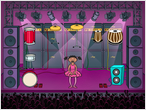
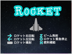
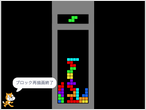
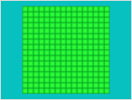
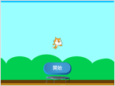
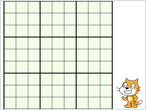
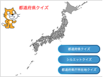

## リズムダンス

{: .img-right}

最初にどのようなことができるのか、娘と二人で確認しながら作ったプロジェクトです。

Scratchのプロジェクトを実行するには、プロジェクトのページで表示されている緑色の旗をクリックします。

+ [リズムダンス プロジェクト](https://scratch.mit.edu/projects/375119370/)

## Rocket

{: .img-right}

実は、リズムダンスよりも作に作り始めたプロジェクトですが、機能の確認をするためにリズムダンスが先に完成した経緯があります。

その昔、Z80でワイヤーフレームで表示して、こういったゲームを作って遊んでいたのでした。 それを思い出しながらデザインやプログラムを組んで楽しみました。 かなり作り込んだので、それなりに楽しめると思います。

+ [Rocket プロジェクト](https://scratch.mit.edu/projects/374562421/)

## テトリス

{: .img-right}

Rocketに気を良くして、定番ゲームのテトリスを作成しました。

当たり判定などをどのようにして組み上げるかが課題で、イベントの発生やオブジェクトの振る舞いを確認するための目的で、プログラムしてあります。 娘にイベント発生が理解しやすいように工夫して、キャット君にいろいろとイベント状況を喋ってもらっています。 デバッガーの一種ですね。

+ [テトリス プロジェクト](https://scratch.mit.edu/projects/374562421/)

## マインスイーパー

{: .img-right}

テトリスに続いて、定番ゲームのマインスイーパーを作成しました。

これは、クローンの使い方を学ぶ目的もありましたが、結構お気に入りのゲームなので、とにかく遊びたかったというのが本音です。 Windowsでは定番のゲームでしたが、これでプラットフォームを気にせず楽しむことができるようになりました。

まったく気がついていませんでしたが、コメントがついていますね。 バグも残っているようなので、対応したいところですが…

+ [マインスイーパー プロジェクト](https://scratch.mit.edu/projects/380008753/)

## 一筆書き

{: .img-right}

クローンの使い方を発展させて、なにかゲームが作れないかなと考えていたときに思いついたのがこれです。

一筆書きと銘打っていますが、一筆書きとはちょっと違うかもしれません。 スタートから同じところを通らずに、すべてのマス目を通過できればクリアという単純なものです。

完成したところで気力が尽きてしまい、そっけないインターフェースになってしまっています。

+ [一筆書き プロジェクト](https://scratch.mit.edu/projects/382329712/)

## とらんぽらん

{: .img-right}

娘がマウスのハンドリングが知りたいというので見本に作成しました。

最初はキャット君がトランポリンするたけのシンプルなものでしたが、娘がつまらんと言うので、昔ハマったクレージーバルーン風に仕上げてみました。

+ [とらんぽらん プロジェクト](https://scratch.mit.edu/projects/380588354/)

## 数独パズル

{: .img-right}

娘がナンプレ本にはまり、何冊も買わされそうになってので、それを避けるために作っちゃいました。

判定にちょっと難があるときがありますが、概ね動作していると思います。 結構力作なんですが…

+ [数独パズル プロジェクト](https://scratch.mit.edu/projects/388790895/)

## 都道府県クイズ

{: .img-right}

娘が課題になかなか取り組まないので、課題を楽しめるようにと作成しました。 とりあえず、課題を終えられたので目的達成です。

+ [都道府県クイズ プロジェクト](https://scratch.mit.edu/projects/391514236/)

## その他

他にも未公開プロジェクトは多数あります。
実験的なものもありますが、インターフェースを作り込んでいないので、公開していないものがほとんどです。

折を見て、GUIを仕上げて公開したいと思っています。

+ [tomomo-tomomo on Scratck](https://scratch.mit.edu/users/tomomo-tomomo/)
