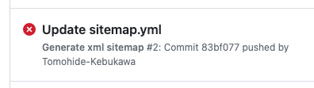

## GitHubのページをGoogle検索でリストさせる

GitHubで公開したリポジトリを他の人に利用してもらうために、直接アクセスするためのURLを教えるのは何かと面倒です。

Googleの検索結果にリストアップされるのであれば、キーワードを教えて検索してもらうのが便利です。
URLを説明するよりも、確実に検索でヒットするキーワードを教えるほうが、ずっと楽だし、相手も簡単に覚えられると思います。

しかし、ただ単にリポジトリを公開するだけでは、いつまでたっても検索結果にはでてきません。

Googleの検索結果に表示されるようにするためには、Googleにリポジトリをクロールして貰う必要があります。 
そのためには、次のことをしなければなりません。

+ サイトマップを用意する
+ Google Search Consoleに登録する

ということで、まずサイトマップを用意することにします。

## sitemapの作成

sitemapは、Googleで検索される公開サイトには必須のものです。
手作業で`sitemap.xml`を用意しても、Googleへの登録には問題ありません。
ですが手作業で作成してしまうと、ページを更新するたびに手作業でサイトマップを更新することになります。
そのため、更新し忘れたり、誤ったxmlを作成したりすると、Google Botが正しくクロールできないという事態になります。

GitHubには、GitHub Actionsという機能があるので、これを使えばページ更新（コミット）したときに自動でサイトマップを生成できます。

参考資料：[GitHub Actionsのドキュメント](https://docs.github.com/ja/actions)

GitHub Actionsを利用するためには、`ワークフロー`と呼ばれるプログラムを書く必要があります。
しかしGithub初心者にとって、ゼロからコーディングするのはハードルが高すぎます。

このような機能は、きっと優秀な先人たちが既に用意しているはずです。
そこで、先人たちが作成しているだうろと、サンプルコードを探してみました。
動作するサンプルコードがあれば、サイトマップの作成を例にして、GitHubアクションを学べるに違いないのです。
学びもできてサイトマップも生成されるので、一石二鳥というわけです。

色々なサイトからコードをコピーしては試してみましたが、なかなか手放しに動作してくれるコードが見つかりません。
そんな中、Marketplaceにきちんと説明された、完璧な見本を発見しました。 それが⇓これです！

+ [Marketplace / Actions / generate-sitemap](https://github.com/marketplace/actions/generate-sitemap)

説明を読むと、特別何かをインストールすることなく動作しそうです。

ということで、上記のページで公開されている[Example 1: Minimal Example](https://github.com/marketplace/actions/generate-sitemap#example-1-minimal-example)をそのまま配置してみました。

## GitHub Actionsの利用

見つけたサンプルコードは、どこに書けば良いのかまではgenerate-sitemapの説明では、はっきりと書かれていません。 こういったところが初心者にはきついところだったりしますが、ヒントはあります。

+ GitHub Actionsの[Workflowsの説明](https://docs.github.com/ja/actions/learn-github-actions/understanding-github-actions#workflows)
+ generate-sitemapのページの[Real Examples From Projects Using the Action](Real Examples From Projects Using the Action)で示されている実際のファイル[sitemap-generation.yml](https://tomohide-kebukawa.github.io/sitemap/#:~:text=sitemap%2Dgeneration.yml)

これらを読み解くと…

+ GitHub Actionsのプログラムはワークフローとしてファイルを置くことで、イベントを受け取って動作する
+ ファイルの拡張子は.yml
+ ファイルの名前は何でも良い
+ ファイルの置き場所は基本的にリポジトリ内の.github/workflowsディレクトリに置く

サイトマップを作成するワークフローのファイルを.github/workflowsディレクトリ内に置いて、あとはコミットをすればサイトマップができるはずです。
ということで、早速実験しました。

## エラーが出た

実際コミットしてためしてみました。
しかし、sitemap.xmlは生成されませんでした。
これまで、他のコードでもうまく行かなかったので、驚きもしませんでしたが少しがっかりです。

エラーの内容を確認するため`Actions`タグをクリックして、Actionsの履歴を確認しました。

すると、エラーが出ていました。



これまでの実験で発生したコード上のエラーとは感触が違うエラーです。 内容を確認してみると…

```text
	if [[ `git status --porcelain sitemap.xml` ]]; then
		git config --global user.name 'github-actions'
		git config --global user.email '41898282+github-actions[bot]@users.noreply.github.com'
		git add sitemap.xml
		git commit -m "Automated sitemap update" sitemap.xml
		git push
	fi
shell: /usr/bin/bash -e {0}
[main 43381b1] Automated sitemap update
 1 file changed, 7 insertions(+)
 create mode 100644 sitemap.xml
remote: Permission to Tomohide-Kebukawa/Tomohide-Kebukawa.github.io.git denied to github-actions[bot].
fatal: unable to access 'https://github.com/Tomohide-Kebukawa/Tomohide-Kebukawa.github.io/': The requested URL returned error: 403
Error: Process completed with exit code 128.
```

コード自体は正しく動作してXMLを生成できているようですが、`git push`でファイルをディレクトリに入れるところで失敗しているのが原因のようです。
つまり原因は、ディレクトリのアクセス権にあるようです。
エラーログを見る限り、アクションで書き換える権利が不足している可能性が高いと思いました。

## アクセス権の変更

ということで、アクセス権に関わる何か設定があるに違いありません。

`Settings`タグを押し、さらに左端にある`Actions`/`General`のリンクを押して設定を確認すると、最後の方にある`Workflow permissions`カテゴリにそれっぽい設定がありました。
デフォルトでは`Read repository contents and packages permissions`オプションが有効にされていますが説明を読むと、このオプションではワークフローは読み取り権限しかありません。
これだと、`git push`で書き換えに失敗すると思います。

ということで`Read and write permissions`オプションを有効にして、ワークフローに書き換えを許可することにします。

## 生成されました

アクセス権を変更したので、早速コンテンツの一部を書き換えて、コミットしてみました。
今度はエラーは解消され、結果、sitemap.xmlは自動で生成されるようになりました。
これでサイトマップの更新については考えることなく、コンテンツの作成に没頭することができるようになりました。

ひとまず、めでたし、めでたし✌

## Google Search Consoleに登録

サイトマップが用意できたので、いよいよ`Google Search Console`に登録です。

`Google Search Console`への登録は、さほど難しいものではありませんが、URLの所有権の確認があります。 検索できるようにするためには、所有権をGoogleに認めてもらう必要があります。 手続きの主な流れは、次のとおりです。

1. Google Search Consoleサイトに行く
1. Googleのアカウント情報を入力してGoogleにログイン
1. URLの登録をURLプレフィックスで行う
1. 所有権確認を求められたら確認用のHTMLファイルをダウンロードをする<br />注：確認ページは表示したままにする
1. ルートフォルダにファイルを入れてコミットする
1. ブラウザで新しいウィンドウを開いて実際のサイトにて確認用HTMLファイルが表示できるか確認
1. 確認用HTMLファイルが表示できたなら、保留していたGoogleの確認ページに戻り「確認」ボタンを押す

このような作業を行うと、直ちにGoogle Botがサイトにある確認用ファイルをクロールしてきます。
Google Botがファイルを無事にクロールすると、無事所有権が確認されたことになります。

あとは寝て待つだけです 😴

数日待つと、無事、Googleの検索結果にリストアップされるようになりました。

> [Google検索結果](https://www.google.com/search?q=%E7%99%BA%E6%98%8E%E3%82%AF%E3%83%A9%E3%83%96+%E5%85%89%E3%82%AA%E3%83%AB%E3%82%B4%E3%83%BC%E3%83%AB+%E3%83%84%E3%83%BC%E3%83%AB)

めでたし、めでたし✌

